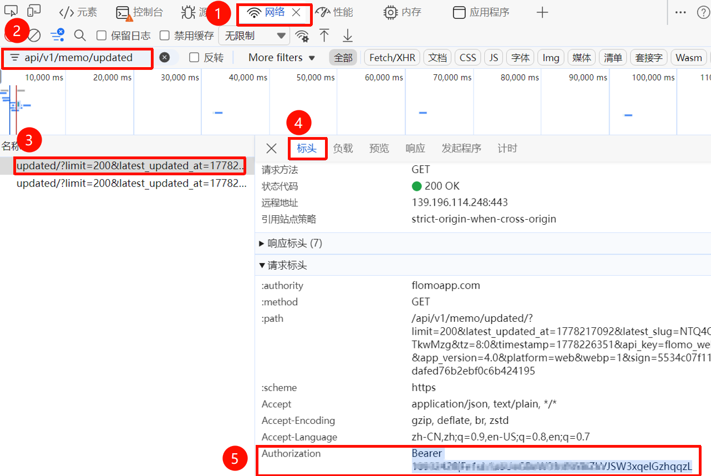

# flomo-web-cli

中文 | [English](README.en.md)

在终端里读写你的 flomo memo：列出、搜索、查看、随机漫游和新建，还能把全部 memo 同步到本地缓存做全库搜索。使用你自己的 flomo Web 登录态，默认输出适合阅读，加 `--json` 即可用于脚本。

<!-- shared: 与 flomo-web-cli / flomo-web-mcp 共用，修改时两个仓库同步 -->

> 本项目不是 flomo 官方项目。它依赖 flomo Web 的内部接口和你自己的会话凭据，接口可能随时变化；请只在你信任的本地环境中运行。

<!-- /shared -->

## 快速开始

```bash
npm install -g flomo-web-cli
flomo-web config set authorization "Bearer your-token-here"
flomo-web list --limit 5
```

`Authorization` 的获取方法见[获取 Authorization](#获取-authorization)。

## 功能

- 最近 memo 列表、关键词搜索、按 `slug` 查看、随机漫游、新建 memo。
- `flomo-web sync` 把全部 memo 写入本地持久缓存，之后可用 `--scope all` 做全库搜索或定位，用 `random --no-sync` 离线随机抽取。
- 默认输出适合人工阅读；加 `--json` 输出结构化结果，便于脚本处理。
- 凭据可以来自用户配置文件、`.env`、环境变量或单次命令参数。

## 要求

<!-- shared: 与 flomo-web-cli / flomo-web-mcp 共用，修改时两个仓库同步 -->

- Node.js 20.19.0 或更高版本（自带 npm / npx）。
- 你自己的 flomo Web 登录态 `Authorization`，获取方法见[获取 Authorization](#获取-authorization)。不需要 flomo Pro。

<!-- /shared -->

## 安装

### 通过 npm（推荐）

```bash
npm install -g flomo-web-cli
flomo-web --help
```

升级到最新版本：

```bash
npm install -g flomo-web-cli@latest
```

### 通过 GitHub 安装最新代码

```bash
npm install -g github:godisabug/flomo-web-cli
```

### 当前源码/本地开发

```bash
git clone https://github.com/godisabug/flomo-web-cli.git
cd flomo-web-cli
npm install
npm run build
node dist/index.js --help
```

用 `npm link` 注册全局 `flomo-web` 命令，用 `npm run verify` 运行完整本地验证。

## 配置

配置来源的优先级从高到低：单次命令的 `--authorization`、环境变量和当前目录的 `.env`、用户配置文件。

最常用的是把凭据写入用户配置文件：

```bash
flomo-web config set authorization "Bearer your-token-here"
flomo-web config set timezone Asia/Shanghai
```

查看配置时，`authorization` 和 `cookie` 等敏感值会被遮蔽：

```bash
flomo-web config list
flomo-web config get authorization
```

用户配置文件的默认路径：

```text
Windows: %APPDATA%\flomo-web-cli\config.json
macOS: ~/Library/Application Support/flomo-web-cli/config.json
Linux: ${XDG_CONFIG_HOME:-~/.config}/flomo-web-cli/config.json
```

### 环境变量

<!-- shared: 与 flomo-web-cli / flomo-web-mcp 共用，修改时两个仓库同步 -->

| 变量 | 默认值 | 说明 |
| --- | --- | --- |
| `FLOMO_AUTHORIZATION` | 无 | **必填。** flomo Web 请求中的 `Authorization`，形如 `Bearer ...`。 |
| `FLOMO_COOKIE` | 无 | flomo Web Cookie，只有接口要求时才需要。 |
| `FLOMO_TIMEZONE` | `Asia/Shanghai` | IANA 时区。flomo 返回的时间和新建 memo 的时间都按它解释。 |
| `FLOMO_REQUEST_TIMEOUT_MS` | `30000` | 单次请求超时，单位毫秒。 |
| `FLOMO_USER_AGENT` | `Mozilla/5.0` | 请求使用的 User-Agent。 |
| `FLOMO_BASE_URL` | `https://flomoapp.com` | flomo API 地址。 |
| `FLOMO_WEB_BASE_URL` | `https://v.flomoapp.com` | flomo Web 地址，用于请求头和 memo 链接。 |
| `LOG_LEVEL` | `info` | `debug`、`info`、`warn` 或 `error`。 |
| `FLOMO_DEVICE_ID` | 每次启动随机生成 | 高级：请求头中的设备 ID。 |
| `FLOMO_DEVICE_MODEL` | `Other` | 高级：请求头中的设备型号。 |
| `FLOMO_WEB_PLATFORM` | `Web` | 高级：请求头中的平台标识。 |
| `FLOMO_READ_ENDPOINT` | 内置路径 | 高级：flomo 内部读取接口变化时临时覆盖。 |
| `FLOMO_SYNC_ENDPOINT` | 内置路径 | 高级：flomo 内部同步接口变化时临时覆盖。 |
| `FLOMO_WRITE_ENDPOINT` | 内置路径 | 高级：flomo 内部写入接口变化时临时覆盖。 |

<!-- /shared -->

每个变量都可以写入用户配置文件，键名为对应的驼峰写法，例如 `FLOMO_REQUEST_TIMEOUT_MS` 对应 `flomo-web config set requestTimeoutMs 60000`。完整示例见 [.env.example](.env.example)。

## 命令

| 命令 | 说明 |
| --- | --- |
| `flomo-web list` | 列出最近 memo，按创建时间倒序。 |
| `flomo-web search <keyword>` | 搜索最近 memo；加 `--scope all` 搜索本地缓存中的全部 memo。 |
| `flomo-web get <slug>` | 查看单条 memo；加 `--scope all` 从本地缓存定位。 |
| `flomo-web sync` | 同步全部 memo 到本地缓存。 |
| `flomo-web random` | 随机漫游一条 memo，可按 tag 过滤。 |
| `flomo-web create <content>` | 新建 memo。 |
| `flomo-web config` | 查看和修改用户配置。 |

数据命令都支持 `--authorization <value>` 覆盖本次调用的凭据，并支持 `--json`。

```bash
flomo-web list --limit 20
flomo-web list --authorization "Bearer your-token-here"
flomo-web list --json
```

```bash
flomo-web search "keyword" --limit 20
flomo-web search "keyword" --scope all
flomo-web search "keyword" --json
```

```bash
flomo-web sync --page-size 200 --max-pages 50
flomo-web sync --json
```

```bash
flomo-web get memo-slug
flomo-web get memo-slug --scope all
flomo-web get memo-slug --json
```

```bash
flomo-web random
flomo-web random --no-sync
flomo-web random --tag work --tag idea
flomo-web random --exclude-tag private
flomo-web random --json
```

```bash
flomo-web create "memo content #tag"
echo "memo content" | flomo-web create --stdin
flomo-web create "memo content" --tag work --tag daily
flomo-web create "memo content" --json
```

```bash
flomo-web config set authorization "Bearer your-token-here"
flomo-web config get authorization
flomo-web config unset cookie
flomo-web config list
```

### JSON 输出

加 `--json` 时，结果以单个 JSON 对象写入 stdout；错误写入 stderr：

```json
{
  "ok": false,
  "error": {
    "code": "AUTH_EXPIRED",
    "message": "..."
  }
}
```

## 缓存

`flomo-web sync` 会写入本地持久缓存，之后 `search --scope all`、`get --scope all` 和 `random --no-sync` 都从缓存中查询。缓存不会自动更新，需要最新数据时重新运行 `flomo-web sync`。

`flomo-web random` 默认会先尝试同步最新 memo；如果同步失败但本地缓存可用，会从缓存中随机抽取并输出警告。需要自定义同步分页时，先运行 `flomo-web sync --page-size 200 --max-pages 50`，再运行 `flomo-web random --no-sync`。

缓存的默认路径：

```text
Windows: %LOCALAPPDATA%\flomo-web-cli\cache\notes.json
macOS: ~/Library/Caches/flomo-web-cli/notes.json
Linux: ${XDG_CACHE_HOME:-~/.cache}/flomo-web-cli/notes.json
```

缓存包含 memo 正文。不要上传、分享或提交缓存文件。

## 获取 Authorization

<!-- shared: 与 flomo-web-cli / flomo-web-mcp 共用，修改时两个仓库同步 -->

以 Microsoft Edge 或 Chrome 为例：

1. 登录 [flomo 网页版](https://v.flomoapp.com)，按 `F12`（macOS 为 `Cmd` + `Option` + `I`）打开开发者工具，切到“网络（Network）”面板。
2. 刷新页面，在筛选框输入 `api/v1/memo/updated`，打开任意一条匹配的请求。
3. 在“标头（Headers）”的 `Request Headers` 中找到 `Authorization`，复制以 `Bearer ` 开头的完整值。



> 只复制 `Bearer ...` 这个值，不要带上 `Authorization:` 字段名。它等同于你的登录态：不要提交到仓库、贴到 issue 或截图公开。返回 `AUTH_EXPIRED` 时说明登录态已失效，按上面的步骤重新获取即可。

<!-- /shared -->

拿到后保存到用户配置：

```bash
flomo-web config set authorization "Bearer your-token-here"
```

## 安全提醒

<!-- shared: 与 flomo-web-cli / flomo-web-mcp 共用，修改时两个仓库同步 -->

- 不要提交或分享 `.env`、`FLOMO_AUTHORIZATION`、`FLOMO_COOKIE`，以及任何包含 memo 内容的文件、日志或 flomo 原始响应。
- 不要把凭据贴到公开 issue、在线调试工具或不信任的第三方服务。
- flomo Web 内部接口可能随时变化。如果读写突然失败，可以用 `FLOMO_READ_ENDPOINT`、`FLOMO_SYNC_ENDPOINT` 或 `FLOMO_WRITE_ENDPOINT` 临时覆盖接口路径，并欢迎提交 issue。

<!-- /shared -->

- CLI 在展示配置时会遮蔽 `authorization` 和 `cookie`，但你仍需要保护好用户配置文件、缓存文件和终端历史。

## 风险声明

<!-- shared: 与 flomo-web-cli / flomo-web-mcp 共用，修改时两个仓库同步 -->

使用本项目即表示你理解并接受以下风险：

- 本项目由社区开发者维护，不代表 flomo 官方，也不获得 flomo 官方背书或服务承诺。
- 本项目按“现状”提供，不保证持续可用、接口稳定、数据完整性或适配所有使用场景。
- 你需要自行确认使用方式符合 flomo 服务条款、所在地区法律法规和所在组织的安全要求。
- 你自行承担因使用本项目产生的账号异常、凭据泄露、数据丢失、请求失败、服务中断或第三方限制等风险。
- 在适用法律允许的最大范围内，项目开发者和贡献者不对上述风险造成的直接或间接损失承担责任。

<!-- /shared -->

## 相关项目

<!-- shared: 与 flomo-web-cli / flomo-web-mcp 共用，修改时两个仓库同步 -->

| 项目 | 形态 | 适合 |
| --- | --- | --- |
| [flomo-web-cli](https://github.com/godisabug/flomo-web-cli) | 命令行工具 `flomo-web` | 在终端或脚本里直接操作 memo |
| [flomo-web-mcp](https://github.com/godisabug/flomo-web-mcp) | MCP stdio server | 让 Claude 等 MCP 客户端读写 memo |

两者共享同一套 flomo 访问逻辑（请求签名、memo 解析、时间处理和错误处理），行为保持一致；共享逻辑更新时，两者会以相同的版本号一起发布。

<!-- /shared -->

## 许可证

<!-- shared: 与 flomo-web-cli / flomo-web-mcp 共用，修改时两个仓库同步 -->

MIT，见 [LICENSE](LICENSE)。

<!-- /shared -->
